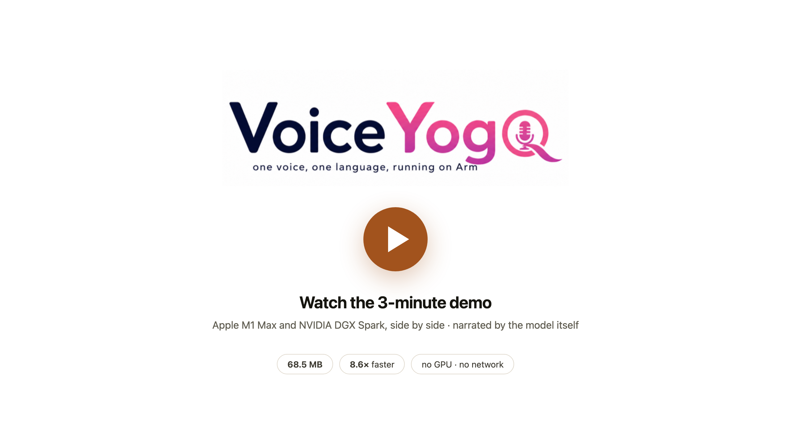
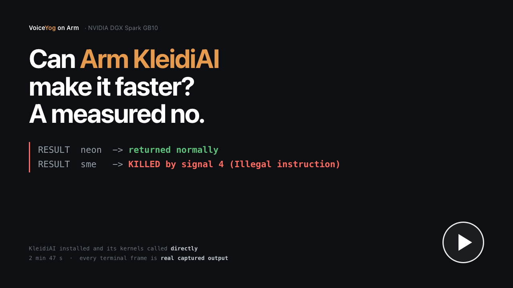

# VoiceYog — one voice, one language, running on Arm

**Tarun Kumar Chawdhury** · DLYog Lab Research Services LLC · Apache 2.0

**[Kokoro-82M](https://huggingface.co/hexgrad/Kokoro-82M)** is one of the best
lightweight text-to-speech models you can get, but on an Arm CPU it takes about
a second to generate a sentence, which is why it is usually run on a GPU.

Most people only ever use one voice. So on an NVIDIA DGX Spark, using its GPU
and distillation from Kokoro, I trained a new model **from scratch** — one
voice, one language, **68.5 MB** — and built an Arm-specific CPU path for it.

**It runs on any modern Arm CPU. No GPU, no internet, no cloud API.**

| | Kokoro-82M, on a GPU | VoiceYog, on an Arm CPU | |
|---|---|---|---|
| model on disk | 326 MB | **68.5 MB** | **4.8× smaller** |
| memory while running | 3464 MB | **356 MB** | **9.7× less** |
| first audio, from cold | 5.42 s | **0.94 s** | **5.8× faster** |
| per sentence, once loaded | **40.1 ms** | 82.9 ms | GPU 2.07× lower latency |
| accelerator | required | **none** | |

Against the *same* Kokoro model on the *same* Arm CPU: **8.6× lower real-time
factor, 11.4× lower per-sentence latency, in 7.5× less memory**. RTF and latency
give different ratios because RTF normalises by the audio produced and latency
does not — both are measured, and both are checked.

**And it carries the quality compromise usual to a distilled student, which I
measured rather than skipped.** Scored with UTMOS22 on 20 held-out sentences,
paired against the teacher on identical text:

| | predicted MOS (95% CI) | on disk | RTF, Arm CPU |
|---|---:|---:|---:|
| Kokoro-82M (teacher) | 4.485 ± 0.017 | 326 MB | 0.33447 |
| **VoiceYog (student)** | **4.250 ± 0.126** | **68.5 MB** | **0.03888** |
| paired difference | **−0.235**, p = 3.8×10⁻⁶ | 4.8× smaller | 8.6× lower |

A Wilcoxon signed-rank test says that difference is real rather than noise, so
I report it as a number: **0.235 predicted MOS buys 4.8× smaller and 8.6× lower
RTF.** UTMOS is a predictor, not a listening panel, and it scores ~3.3 on
silence — so trust the delta, not the absolute.

Predicted MOS is about naturalness, not about whether the words survive, so
intelligibility is measured separately — **WER 0.0186**, **CER 0.0245**, with
**19 of 20** sentences transcribed back exactly. The compromise is therefore one
of polish rather than content: the words arrive intact, and what the smaller
model gives up is in the delivery.

**Re-run that yourself in one command** (see [Reproduce the quality numbers](#reproduce-the-quality-numbers)):

```bash
python3 2_arm_optimization/8_wer_cer.py
```

The one imperfect transcript is not a synthesis failure: the reference says
"three hundred fifty" and Whisper wrote "350". I report 0.0186 as measured
rather than teaching the normalizer to expand numerals after seeing which
sentence failed.

Read that figure against what produced it. The student was **deliberately
undertrained**: **3.06 hours** of teacher audio, **180 epochs**, roughly ten
hours on one GB10, and a **3.76 M-parameter vocoder** against the teacher's
19.69 M. I stopped there on purpose, because the point was the deployment
argument rather than a quality record. Every conventional scaling lever — more
audio, more epochs, more vocoder capacity — is still in its lowest position, and
each costs GPU time at training and nothing at inference. So 0.235 characterises
*this* budget rather than the method. I have not run that experiment and predict
no particular figure.

Two uses, one set of scripts: **serve an AI voice**, or **clone your own** —
see [`4_voice_pipeline/`](4_voice_pipeline).

---

## Demo

[](https://www.youtube.com/watch?v=L4THa8PWQi4)

**▶ [youtube.com/watch?v=L4THa8PWQi4](https://www.youtube.com/watch?v=L4THa8PWQi4)** — 4 minutes.
Apple M1 Max on the left, NVIDIA DGX Spark GB10 on the right, running the same
repository and the same commands.

Watch the SERVER panel in both: same model, same version, same 68.5 MB — and the
Mac loads **8 threads** while the DGX Spark loads **9**. Nothing was configured.
That number is the optimization, and it is read off the silicon at startup.

**Both voices in the video were made by this project**, and neither came from a
commercial TTS service. The narration is my own voice, cloned from a single 33
second recording with Qwen3-TTS running locally on the DGX Spark, and the two
scenes where the model is on screen doing its job are spoken by the 68.5 MB Arm
model itself, on the CPU — the same model these packages install. A heavyweight
GPU model clones you once, and the small thing it produces runs on a CPU
afterwards.

### Second video — can KleidiAI make it faster? A measured no

[](https://github.com/dlyog/voiceyog-arm/raw/main/3_evidence/video/voiceyog_kleidiai_findings.mp4)

**▶ [voiceyog_kleidiai_findings.mp4](https://github.com/dlyog/voiceyog-arm/raw/main/3_evidence/video/voiceyog_kleidiai_findings.mp4)** — 2 min 47 s, 5.3 MB,
[committed in this repository](3_evidence/video/voiceyog_kleidiai_findings.mp4)
so it stays with the evidence it is about.

Arm's KleidiAI ships hand-written matrix kernels and Microsoft wired them into
ONNX Runtime, so the obvious question was whether switching it on makes this
model faster. **It cannot run here at all** — and rather than argue that from
documentation, the video shows KleidiAI being installed and its kernels called
directly: the NEON one returns, the fp32 SME one dies on `SIGILL`. It also
shows the thing I was not looking for, a **2× regression from thread
placement**. Every terminal frame is real captured output; nothing was
screen-recorded or typed for the camera. Full write-up in [`kheledi/`](kheledi).

---

## Start here

Three things, in this order. The first two need nothing installed.

| | | time |
|---|---|---|
| **1** | ▶️ **[Watch the demo](https://www.youtube.com/watch?v=L4THa8PWQi4)** — Apple M1 Max and DGX Spark side by side, with both voices made by this project. | 4 min |
| **2** | ✅ `python3 3_evidence/verify_claims.py` — checks all 55 figures in this README against the measurements. No dependencies, no model, no network. | 5 s |
| **3** | ⚡ `bash manage.sh install` — clean machine to a talking server. | 2 min |

🔬 **[Reproduce the quality numbers](#reproduce-the-quality-numbers)** — one
command on a DGX Spark, no setup.
📐 **[ARCHITECTURE.html](ARCHITECTURE.html)** — the whole design in one picture.
📄 **[VoiceYog_Devpost_Submission.md](VoiceYog_Devpost_Submission.md)** — the full
write-up, with the reasoning behind every number.
📝 **[Distribution-Time Voice Specialization](https://www.dlyog.com/papers/DistributionTimeVoiceSpecialization)**
([PDF](https://www.dlyog.com/papers/DistributionTimeVoiceSpecialization.pdf)) — the preprint
that generalises this result: choose the voice at distribution time, not inside
the network, and one N-voice deployment becomes N single-voice specialists.

---

## Run it

```bash
brew install espeak-ng                 # macOS   ·   sudo apt-get install espeak-ng on Linux
git clone https://github.com/dlyog/voiceyog-arm.git && cd voiceyog-arm
bash manage.sh install
```

Three commands, from a clean machine to a voice. `install` works out whether
this is Apple Silicon or a DGX Spark, fetches the right package, verifies its
sha256, installs it — 102 more checksums, 32 vendored wheels, **pip never
touches the network** — starts the server and prints a URL:

```
  serving            kokoro-heart-new:v3  8 threads  68.5 MB
  open  http://127.0.0.1:8823
```

Open it and type something.

```
bash manage.sh  install | start | stop | status | log [N] | demo [text] | uninstall
```

Prerequisites are checked **before** the 170 MB download, so a missing
phonemizer costs you two seconds rather than two minutes.

<details>
<summary>Where the packages live, and how to install one by hand</summary>

<br>

The two packages are
[**release assets**](https://github.com/dlyog/voiceyog-arm/releases/latest), not
files in this repository — both exceed GitHub's 100 MB per-file limit, and Git
LFS bills bandwidth per download. Checksums are committed in
[`1_packages/SHA256SUMS`](1_packages/SHA256SUMS).

| target | hardware | size |
|---|---|---|
| `apple-silicon` | macOS 13+ on M-series | 171 MB |
| `dgx-spark` | aarch64 Linux, DGX Spark GB10 | 154 MB |

Each is fully self-contained and needs none of `manage.sh`:

```bash
bash 1_packages/download.sh          # detects your machine, verifies sha256
unzip voiceyog-kokoro-heart-new-v3-*.zip
cd voiceyog-local-tts-kokoro-heart-new-*
bash install.sh && bash start.sh
```

`espeak-ng` is the phonemizer. It is invoked as a **separate executable** and its
code is never linked into the VoiceYog runtime. eSpeak NG is GPL-3.0-or-later;
that sentence describes the engineering arrangement only and is not a statement
about licensing consequences.

</details>

---

## Why one voice

Kokoro-82M is excellent, and it is excellent at being *general* — eleven voices,
several languages, in 326 MB. Almost nobody uses it that way. A person who has
banked their own voice — before illness takes it, or simply because it is
theirs — needs exactly **one** voice, forever, on hardware they own, with no
network and no subscription.

So this is not a diminished Kokoro. It is Kokoro **specialised**: the same
architecture, one voice, re-tuned for the CPU it will actually live on. And
specialising changes what the model has to contain at all:

| Kokoro-82M component | params | needed for one voice? |
|---|---|---|
| `decoder.decode` (style conditioning) | 27.94 M | **no — multi-voice machinery** |
| `predictor` (prosody) | 16.20 M | no |
| `decoder.encode` | 5.66 M | no |
| `bert` + `text_encoder` | 11.90 M | ours is smaller |
| `decoder.generator` (vocoder) | 19.69 M | yes — ours is 3.76 M |

The single largest component exists only to condition on *which* voice you
asked for. For this user it is dead weight, not a feature being sacrificed.

---

## Architecture

One pipeline. A recording goes in, and a voice that runs on an Arm CPU comes
out. Every box is a script in this repository.


**The GPU appears once, in `7_train.py`.** Everything after the export runs on
the CPU — which is the whole point. Full walkthrough with the output each step
actually printed: [`4_voice_pipeline/`](4_voice_pipeline).

---

## Reproduce the quality numbers

Every speed figure in this README is already checked by
`3_evidence/verify_claims.py`. The two quality figures are re-runnable from
scratch, and this is how.

**On a DGX Spark, after `bash manage.sh install`:**

```bash
python3 2_arm_optimization/8_wer_cer.py
```

That is the whole command. On first run it builds a private virtualenv beside
the script, installs Whisper into it, and re-executes itself there — your system
Python and the serving environment are untouched. Then it synthesizes the 20
held-out sentences with the model you just installed, transcribes them back, and
writes `3_evidence/wer_cer_dgx_spark.json`.

Expected output:

```
  model      ~/.voiceyog/models/kokoro-heart-new/v3/kokoro-heart-new.onnx
  sentences  20 held-out
  whisper    small.en

  WER 0.0186   CER 0.0245   exact 19/20
```

Then re-run the checker and watch the intelligibility claims verify against the
file you just produced:

```bash
python3 3_evidence/verify_claims.py | grep -i intelligibility
```

| flag | why |
|---|---|
| `--whisper base.en` | faster ASR — but it **changes the number**, see below |
| `--model <path.onnx>` | score a different checkpoint |
| `--no-bootstrap` | use the current interpreter, skip the venv |

**WER is a property of the pair, not of the model alone.** The same audio scored
with `base.en` instead of `small.en` gives WER 0.0435 and 16/20 exact — the ASR
got weaker, the speech did not change. That is why the evidence file records
which ASR produced the number, and why the checked claim is pinned to the
default `small.en`. Compare across engines only if you re-score both sides.

**What the script does and does not do.** It scores the *shipped* model against
text it was never trained on, listed in
[`4_voice_pipeline/tts/eval_sentences.txt`](4_voice_pipeline/tts/eval_sentences.txt).
Corpus WER is total word edits over total reference words — not the mean of
per-sentence rates, which would let a three-word sentence outweigh a twenty-word
one. The text normalizer is printed into the evidence file, because a WER is
meaningless unless you know which normalizer produced it: lowercase, strip
accents, drop punctuation apart from apostrophes, collapse whitespace. It does
**not** expand numerals, which is why the one imperfect sentence scores as three
substitutions when Whisper writes "350" for "three hundred fifty".

The predicted-MOS figures come from
[`2_arm_optimization/7_predicted_mos.py`](2_arm_optimization/7_predicted_mos.py),
which scores both engines with UTMOS22 and writes
`3_evidence/mos_eval_dgx_spark.json`. It needs Kokoro installed to generate the
teacher side, so it is the heavier of the two to reproduce.

---

## Provenance, and deployment identity

Every clip carries a signed record naming the model, its checksum, the runtime
and the platform. It verifies offline — the recipient needs neither the model
nor the private key — and it is tamper-evident: flip one bit of the audio and
the check fails.

Regulation is moving toward persistent provenance for AI-generated audio;
California's AI Transparency Act ([SB 942](https://leginfo.legislature.ca.gov/faces/billTextClient.xhtml?bill_id=202320240SB942)),
as amended by [AB 853](https://leginfo.legislature.ca.gov/faces/billTextClient.xhtml?bill_id=202520260AB853),
becomes operative on 2 August 2026 for covered providers. Provenance today
usually establishes *that* audio was generated and by which system, but not
*which voice* — in a shared multi-voice model the voice is a runtime argument,
not a property of the artifact. Specialising to one voice changes that at no
extra cost: one voice is one file, so the checksum already in the record
identifies the voice, because there is exactly one voice that file can produce.

**What this is not.** The record is detached, not embedded. It is not a
watermark, it can be stripped by anyone redistributing the audio, and it does
not let a listener identify a voice by hearing it. It does not satisfy a
latent-disclosure requirement, and this project is far below the
one-million-user threshold that defines a covered provider — so no compliance
of any kind is claimed. Pairing this with an acoustic watermark is the obvious
next step and is not built. See §9.1 of the
[preprint](https://www.dlyog.com/papers/DistributionTimeVoiceSpecialization).

*Research work; may contain inaccuracies. Not legal advice.*

---

## How it gets there

Two things, and neither is a compression trick.

**One voice instead of eleven.** Kokoro spends 27.94 M parameters on machinery
whose only job is to condition on *which* voice you asked for. Trained from
scratch on one voice, that capacity is not compressed — it is not there.
326 MB becomes 68.5 MB.

**An Arm-specific CPU path.** Both targets are **asymmetric** Arm parts, and
that asymmetry is worth up to 2.2×:

```
DGX Spark GB10   10x Cortex-X925 @ 3.90 GHz  +  10x Cortex-A725 @ 2.81 GHz
Apple M1 Max      8 performance cores        +   2 efficiency cores
```

ONNX Runtime parallelises an operator across intra-op threads and joins them.
That join is a barrier — the operator finishes when its **slowest** thread
does. One thread on a core 28% slower holds up every other thread, on every
operator, for the whole graph. So on these parts, **adding cores subtracts
latency**:

| | best threads | vs handing it every core | vs ONNX Runtime's default |
|---|---|---|---|
| DGX Spark GB10 (20 cores) | 9 | **1.39× faster** | **1.65× faster** |
| Apple M1 Max (10 cores) | 8 | **2.21× faster** | 1.20× faster |

The count is derived at runtime from `MIDR_EL1` and `cpu_capacity` on Linux and
`hw.perflevel0` on macOS — never hard-coded, never guessed from a core count.
**One ONNX graph, one binary, retuned per Arm part with no recompilation.**

On both machines the topology's prediction *was* the measured optimum: 9 on
GB10, 8 on M1 Max.

> **The detail a core count would have missed.** On GB10 the performance cores
> are **not contiguous** — they are `5-9,15-19`, interleaved across two
> clusters. `taskset -c 5-14` reads exactly like "pin to the fast half" and
> lands five of ten threads on efficiency cores.

### Where the Arm CPU time actually goes

Tuning ONNX Runtime's threads only matters if ONNX Runtime is where the time
is. That is a claim about cycles, so I measured it with Arm's own profiler —
[**Arm Performix**](https://developer.arm.com/documentation/109842/latest/),
`code_hotspots` recipe, 41,593 samples on a DGX Spark GB10:

| share | image |
|---|---|
| **94.0%** | ONNX Runtime — fused CPU kernels |
| 3.1% | OpenBLAS |
| 2.0% | libc |
| 0.3% | espeak-ng · 0.2% Python |

**Almost nothing is interpreter overhead.** That is what makes the thread
result meaningful: the knob is attached to 94% of the workload, not to a thin
wrapper around it. Reproduce it with
[`5_profile_with_performix.py`](2_arm_optimization/5_profile_with_performix.py);
raw output in
[`3_evidence/arm_performix_profile_dgx_spark.json`](3_evidence/arm_performix_profile_dgx_spark.json).

ONNX Runtime ships stripped, so samples inside it resolve to `<Unknown code>`
rather than individual kernels. Image-level attribution is still meaningful;
per-kernel names would need a symbolised build.


---

## Results

DGX Spark GB10, idle GPU, 20 held-out sentences, each engine in its own
process. Raw output: [`3_evidence/benchmark_of_record_dgx_spark.json`](3_evidence/benchmark_of_record_dgx_spark.json)

| engine | RTF | latency | peak RSS | model |
|---|---|---|---|---|
| **ours — Arm CPU only** | **0.03888** | 82.9 ms | **356 MB** | 68.5 MB |
| ours — Arm CPU → GPU | 0.01957 | 42.2 ms | 1898 MB | 68.5 MB |
| Kokoro-82M — GPU | 0.01418 | 40.1 ms | 3464 MB | 326 MB |
| Kokoro-82M — Arm CPU | 0.33447 | 947.5 ms | 2661 MB | 326 MB |

**Read the first and last rows together.** Kokoro reaches 40 ms on a GPU, using
3.4 GB. VoiceYog needs a CPU core and 356 MB to reach 83 ms — twice the
latency, **9.7× less memory, no accelerator at all**, and **5.8× faster to the
first word** because there is no CUDA context to build and no 326 MB to push
into VRAM.

Against the same model on the same CPU it is **8.6× faster in 7.5× less
memory**. That is the row both packages ship.

**And the one that goes the wrong way: the cooperative path is 0.72×
Kokoro-GPU — slower.** Running an entire model on CUDA beats splitting one
across a device boundary. What the split buys is real Arm CPU participation at
GPU-class latency in 1.8× less memory:

| stage | time | share |
|---|---|---|
| Arm CPU — encoder, duration predictor, flow | 14.21 ms | **57.4%** |
| handoff — unified memory (NVLink-C2C) | **0.1215 ms** | 0.49% |
| Blackwell GPU — vocoder | 10.43 ms | 40.3% |

Every utterance uses both processors; neither can produce audio alone.

---

## Verify it yourself

```bash
python3 3_evidence/verify_claims.py
```

No dependencies, no model, no network. It checks **all 55 figures** in this
README against the JSON the measurement scripts wrote, and exits non-zero if
any disagree.

Then, on your own silicon:

```bash
python3 2_arm_optimization/1_core_topology.py           # your cores, from the registers
python3 2_arm_optimization/6_cold_start.py --help       # launch to first audio, cold
B=1_packages/voiceyog-local-tts-kokoro-heart-new-*
$B/.venv/bin/python3 2_arm_optimization/2_thread_sweep.py --json sweep.json
```

The sweep takes about a minute and prints the tuning table for **your** machine.
It will contradict me if I am wrong.

---

## What is here

```
manage.sh            install | start | stop | status | log | demo | uninstall
ARCHITECTURE.html    the design in one picture
VoiceYog_Devpost_Submission.md   the full write-up

1_packages/          download.sh + SHA256SUMS   (the zips are release assets)
2_arm_optimization/  the optimization, as four scripts you can run
3_evidence/          every number, in the file that produced it
4_voice_pipeline/    build your own voice - 8 scripts, tested end to end
```

The reusable part is `2_arm_optimization/`. `1_core_topology.py` answers "how
many threads should ONNX Runtime get on this machine" for **any** ONNX workload
on **any** asymmetric Arm part — not just this one, and not just TTS.

---

## The optimization I did not ship

INT8 dynamic quantization is the reflex answer for Arm. Here the quantized
model **will not load at all**, on both targets, at the same node:

```
float32   71.8M    80.29 ms      (DGX Spark, 9 threads)
int8      21.5M    does not run

NOT_IMPLEMENTED : Could not find an implementation for ConvInteger(10)
                  node '/enc_p/encoder/attn_layers.0/conv_q/Conv_quant'

    183x  ConvInteger        162x  DynamicQuantizeLinear
```

`quantize_dynamic` rewrote all 183 convolutions into `ConvInteger`, for which
ONNX Runtime's CPU provider has no aarch64 kernel. A one-line change made the
file 3.3× smaller and produced an artifact that runs nowhere.

Reproduce it: `2_arm_optimization/3_int8_negative_result.py`.

---

## Limitations

- **Quality is below the teacher's.** 3 h of distilled audio and a 3.76 M
  vocoder against Kokoro's 19.69 M. The training audio came *from* Kokoro, so
  Kokoro is a hard ceiling by construction.
- **Chunked pipelining is not built.** The Arm CPU prefix is 57.4% of the
  pipeline and runs strictly before the GPU stage, so each processor idles
  while the other works. Overlapping `prefix(N+1)` with `decode(N)` is the
  largest remaining win. Designed, not built, not claimed.
- **KleidiAI cannot run on either target, and I tested that rather than
  inferring it.** The packages ship onnxruntime 1.20.1, which contains **0**
  KleidiAI symbols on either target; a 1.28.0 build on the same DGX Spark
  contains **11** `kai_run_matmul_*` symbols. Those symbols are unreachable
  here. ONNX Runtime installs every KleidiAI kernel behind one check —
  `HasArm_SME() || HasArm_SME2()` in `mlas/lib/platform.cpp` — and neither
  GB10's Cortex-X925/A725 nor the M1 Max implements SME. So I installed
  KleidiAI myself and called its kernels directly, bypassing ONNX Runtime: on
  **both** machines its NEON kernel returns normally and its fp32 SME kernel
  dies on **SIGILL**, before it touches any matrix data. The gate is not a
  limitation of ONNX Runtime; it is the check that prevents that crash.
  It would also be the wrong target: profiling with the performance cores
  pinned puts about **70%** of kernel time in convolution (68.6-71.1% over
  four runs) and under **1%** in matmul, and the KleidiAI kernels that *do*
  run on these CPUs are INT4 matmul kernels, while this model is FP32.
  Upgrading the pin is worth **5.2%** at p50 over 1,200 inferences — as a
  general runtime improvement, not a KleidiAI one — but **only with the
  performance cores pinned.** Left unpinned, 1.28.0 is bimodal on GB10:
  usually 58–60 ms, and repeatedly **~120 ms, a 2× regression**, on an idle
  machine, because the scheduler places part of the intra-op pool on
  Cortex-A725 efficiency cores and the join barrier then waits on them.
  1.20.1 never showed that. Reproduce all of it in [`kheledi/`](kheledi).
- **English only, one voice, by design.** Not validated beyond ~6.25 s per
  chunk; longer text is chunked by sentence automatically.

---

## Built on open source, with thanks

**None of this exists without work that other people gave away.**

⭐ **[Kokoro-82M](https://huggingface.co/hexgrad/Kokoro-82M)** (Apache-2.0) is
the one to star. It is the gold standard for lightweight TTS — 82 M parameters
producing audio that much larger models struggle to match — and it is both the
teacher this model was distilled from and the baseline it is measured against.
Every comparison in this repository exists because Kokoro was good enough and
open enough to measure against. **I did not beat Kokoro. I specialised it**,
for one voice on one class of CPU. This work is not affiliated with or endorsed
by it.

| project | licence | what it gave this work |
|---|---|---|
| [Kokoro-82M](https://huggingface.co/hexgrad/Kokoro-82M) | Apache-2.0 | the teacher voice, the training audio, and the baseline |
| [VITS](https://github.com/jaywalnut310/vits) | MIT | the student architecture |
| [HiFi-GAN](https://github.com/jik876/hifi-gan) | MIT | the vocoder the 3.76 M generator is |
| [ONNX Runtime](https://onnxruntime.ai/) | MIT | the CPU inference engine, and the thread knob this whole submission turns |
| [espeak-ng](https://github.com/espeak-ng/espeak-ng) | GPL-3.0 | phonemisation — run as a **separate process**, never linked |
| [NumPy](https://numpy.org/) · [FastAPI](https://fastapi.tiangolo.com/) · [uvicorn](https://www.uvicorn.org/) · [pydantic](https://docs.pydantic.dev/) · [cryptography](https://cryptography.io/) | BSD / MIT / Apache-2.0 | the runtime, the API, and the signatures |
| [CMU ARCTIC](http://www.festvox.org/cmu_arctic/) | free | prompt text only — none of their recorded audio is used |

The shipped runtime is permissively licensed throughout. `espeak-ng` is GPL-3.0
and is invoked as a separate process — running a program is not linking — which
is why the Python bindings that *would* link it are deliberately not used.

---

## How to cite

If the thread-tuning utility, the model, or the measurements here are useful in
your work, please cite the repository:

```bibtex
@software{chawdhury2026voiceyogarm,
  author       = {Chawdhury, Tarun Kumar},
  title        = {VoiceYog on Arm: Single-Voice TTS Distillation and
                  Topology-Derived Thread Tuning for Asymmetric Arm CPUs},
  year         = {2026},
  url          = {https://github.com/dlyog/voiceyog-arm},
  organization = {DLYog Lab Research Services LLC},
  license      = {Apache-2.0}
}
```

Plain text:

> Tarun Kumar Chawdhury. *VoiceYog on Arm: Single-Voice TTS Distillation and
> Topology-Derived Thread Tuning for Asymmetric Arm CPUs.* DLYog Lab Research
> Services LLC, 2026. https://github.com/dlyog/voiceyog-arm

**Please cite Kokoro-82M as well.** It is the teacher this model was distilled
from and the baseline every measurement here is taken against — none of these
numbers mean anything without it:

```bibtex
@misc{kokoro82m,
  title        = {Kokoro-82M},
  howpublished = {\url{https://huggingface.co/hexgrad/Kokoro-82M}},
  note         = {Apache-2.0}
}
```

And the architectures the student is built from —
[VITS](https://github.com/jaywalnut310/vits) (Kim et al., 2021) and
[HiFi-GAN](https://github.com/jik876/hifi-gan) (Kong et al., 2020).

---

## Licence

Copyright © 2026 Tarun Kumar Chawdhury, DLYog Lab Research Services LLC.
Apache License 2.0 — see [`LICENSE`](LICENSE).

**Disclaimer.** This is research work. It may contain inaccuracies, the
measurements describe the two machines they were taken on, and any discussion
of regulation is engineering motivation rather than a compliance assessment —
nothing here is legal advice.

The model weights are published separately at
[huggingface.co/dlyog/af_heart_arm_tts](https://huggingface.co/dlyog/af_heart_arm_tts).
The packages in the release bundle their weights directly, so nothing here
depends on that repository being reachable.
